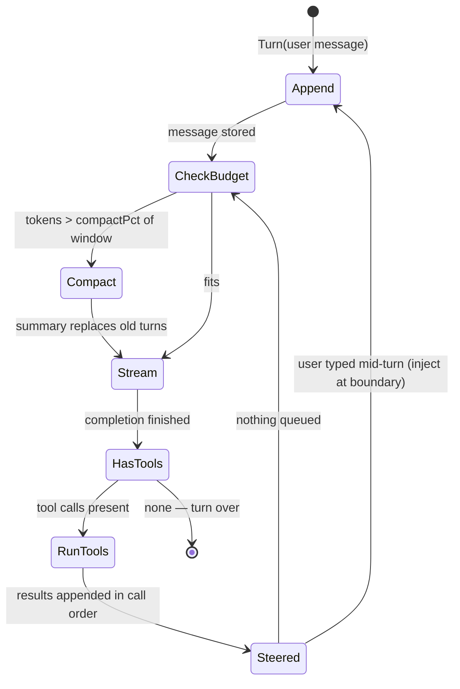
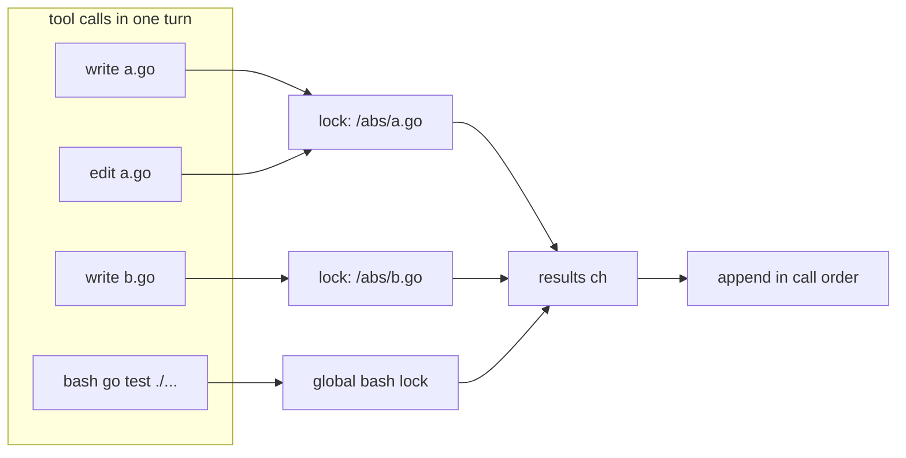
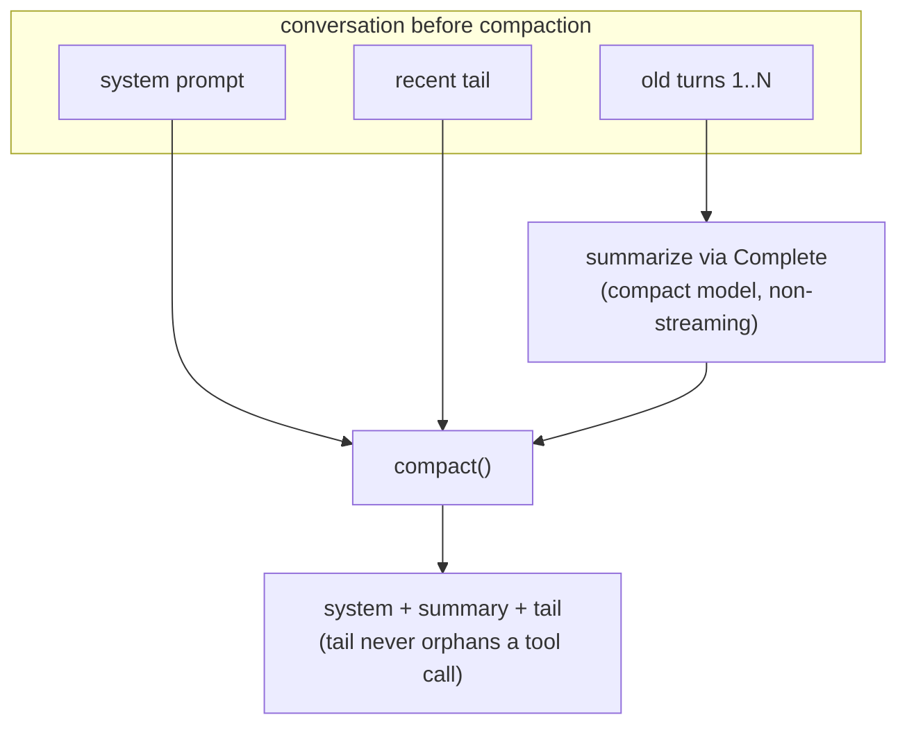

# The agent loop

`internal/agent/agent.go` — `Agent.Turn` is the whole idea: append the user
message, stream a completion, run any tool calls, append results, repeat
until the model stops calling tools.

## The cycle

Three properties worth knowing:

1. **Steering injects at loop boundaries only.** `Steer` queues a message;
   it lands between iterations, after tool results are appended — never
   mid-generation. Same mechanism delivers background-subagent reports.
2. **A context-limit error is recoverable.** If the provider rejects a
   request (`context_length_exceeded`, `prompt_too_long`, HTTP 413), the
   loop compacts once and retries. A `compacted` guard prevents retry loops.
3. **The loop is headless.** Events (tokens, tool start/end, compaction)
   flow out through a typed `Events` struct; the TUI is one consumer, tests
   are another. `Events.FanIn` merges subagent event streams.

## Parallel tool calls

When the model emits several tool calls in one turn, `runTools` fans them
out to goroutines. Mutations to the same file serialize through a
per-canonical-path channel lock; everything else runs truly in parallel.
Results land back in **call order**, because the chat API matches tool
results to call IDs.

`bash` takes the global lock because a command's side effects aren't
attributable to one path. Reads don't lock. The why and the Go idiom:
[concurrency.md](concurrency.md).

## Compaction

Context is a budget, and the loop spends it deliberately:

- **Proactive** — `maybeCompact` runs before each request once the latest
  successful request's provider-reported context size (`PromptTokens +
  CompletionTokens`) crosses a percent of the advertised window (default 50%,
  `compactPct` in config, slidable ←/→ in the ctrl+p settings). It is zero
  until the first successful response.
- **Reactive** — a provider context-limit error triggers one compaction +
  retry.

`compact()` keeps the system prompt plus a recent tail, and is
**orphan-safe**: a tail that begins with a `tool`-role message walks back to
its owning assistant message, so no tool result references an erased call ID.

Tool results are structured before this boundary. The summary ledger records
bounded arguments/output, exit status, duration, and artifact metadata; the
derived prompt carries a metadata-only manifest for references cited by the
summary or kept tail. A recent result that exceeds the remaining token budget
is shrunk deterministically without dropping its artifact id, while the raw
SQLite message log remains available for resume, retry, audit, and
`artifact_read`.

The summarizer defaults to `deepseek-v4-flash-0731`
(`config.DefaultCompactModel`), falls back to the configured
`compactModel`/`compactProvider`, then to the conversation's own model.
`/compact [model] [provider]` does it by hand.

## Background subagents

`task` with `background: true` runs a subagent concurrently and reports back
as a steered message on completion — one channel close wakes the tool
caller, the TUI redraw, and `/tasks` simultaneously. Details:
[concurrency.md](concurrency.md#2-background-subagents--one-channel-close-many-waiters).

## Read next

- [concurrency.md](concurrency.md) — the channel primitives
- [tools.md](tools.md) — what the tool calls actually do
- [features.md](features.md#the-agent-loop) — the same loop, linked to code and tests
