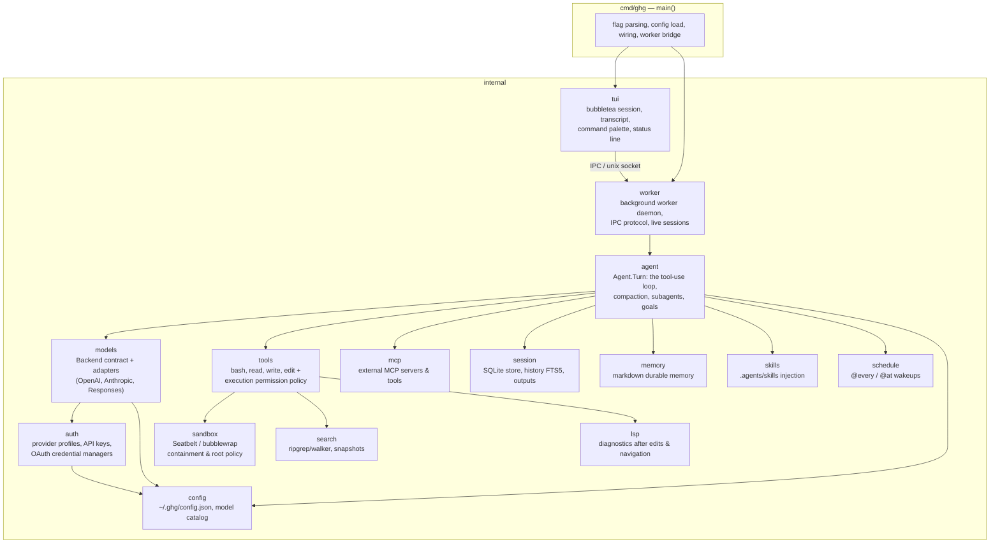
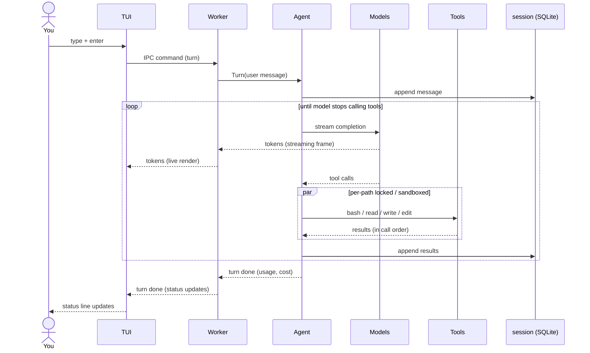

# Architecture

How a keystroke becomes a tool call. ghg is a single Go binary with no
framework between you and the code — each box below is one package under
`internal/`.

## The moving parts

Dependencies point one way: `tui` owns the screen, `worker` orchestrates live background execution, `agent` owns the conversation loop, and the remaining packages are specialized leaves. Nothing imports `tui` except `cmd/ghg` — the core loop is headless-testable, and `ghg mcp serve` reuses the tools without a UI.

## One turn, end to end

Key invariants:

- **The loop is synchronous; concurrency is internal.** From the caller's view a
  turn is one call. Parallelism (fan-out tool calls, background subagents)
  happens inside `agent` and reports back through typed events.
  See [concurrency.md](concurrency.md).
- **Steering happens at loop boundaries.** A message you send mid-turn is
  queued and injected between iterations — never spliced into a half-streamed
  completion.
- **The provider is an adapter selected at the boundary.** `agent` consumes
  `models.Backend`; compiled adapters speak OpenAI-compatible chat completions,
  OpenAI `/responses`, and Anthropic `/messages`. Routing, profile metadata,
  discovery, pricing, and fallback context windows live in `config` + `auth` +
  `models` + the catalog caches. See [models-providers.md](models-providers.md).

## Where things live on disk

| Path | What | Format |
|---|---|---|
| `~/.ghg/config.json` | providers, models, roles, MCP, and UI settings | JSON, hand-editable |
| `~/.ghg/sessions.db` | conversation history, tasks, retained outputs, history index | SQLite |
| `~/.ghg/models.json` | provider `/models` catalog cache | JSON, 24h TTL |
| `~/.ghg/models-dev.json` | public context and reasoning metadata for listed models | JSON, 24h TTL |
| `~/.ghg/providers/*.yaml` | user provider profiles | strict YAML, non-secret metadata |
| `.ghg/providers/*.yaml` | trusted-project provider profiles | strict YAML, non-secret metadata |
| `~/.ghg/memory.md` | durable memory the model maintains | Markdown checkboxes |
| `.agents/skills/` (repo) | project skills injected into sessions | Markdown `SKILL.md` |
| `.agents/*.md` (repo) | custom agent prompt and role definitions | Markdown with frontmatter |
| `.mcp.json` (repo) | project MCP server configurations | JSON |
| `~/.ghg/workers/` | live worker unix sockets and state | Unix domain sockets / JSON |

## Package map

| Package | Purpose |
|---|---|
| `cmd/ghg` | CLI entry point, subcommands (`run`, `auth`, `mcp`, `worker`, `session`, `export`), worker process bridge |
| `internal/agent` | the tool-use loop: `Agent.Turn`, compaction, background subagents, goals, todos |
| `internal/auth` | provider profiles, API key resolution, OAuth credential managers, and catalog probing |
| `internal/config` | configuration file (`~/.ghg/config.json`), model catalog cache, provider/role resolution |
| `internal/export` | session transcript and workflow result export (Markdown, JSON) |
| `internal/lsp` | stdlib-only JSON-RPC client for gopls diagnostics and code navigation |
| `internal/mcp` | Model Context Protocol client: stdio and SSE transports, lazy connect, auto-reconnect |
| `internal/memory` | Markdown-file durable memory |
| `internal/models` | provider-neutral LLM client: protocol adapters (OpenAI, Anthropic, Responses), streaming, usage/pricing |
| `internal/observation` | read observation recording and validation for safe multi-file edits |
| `internal/sandbox` | OS-level execution confinement: macOS Seatbelt, Linux bubblewrap, root policy enforcement |
| `internal/schedule` | `@every` / `@at` recurring and one-shot wakeup timers |
| `internal/search` | native file search, regex search (`rg` streaming + Go walker), gitignore filtering, snapshot caching |
| `internal/session` | SQLite persistence for conversations, forks, tasks, history search (FTS5), and output store |
| `internal/skills` | project (`.agents/skills/`) and user (`~/.ghg/skills/`) discovery and prompt injection |
| `internal/sys` | platform helpers, process ownership, and system-level utilities |
| `internal/telegram` | Telegram bot notification client for completion alerts |
| `internal/tools` | tool definitions (`bash`, `read`, `write`, `edit`, etc.) and command security permission engine |
| `internal/tui` | Bubbletea terminal UI: transcript viewport, input box, command palette (`ctrl+p`), status line |
| `internal/worker` | background worker daemon process, Unix socket RPC protocol, and turn execution engine |
| `internal/workspace` | workspace directory detection, boundary checking, and root path normalization |

## Read next

- [agent-loop.md](agent-loop.md) — the loop in detail
- [concurrency.md](concurrency.md) — the channel patterns
- [features.md](features.md) — full feature map linked to code and tests
