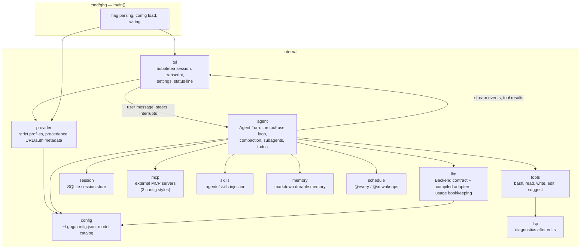
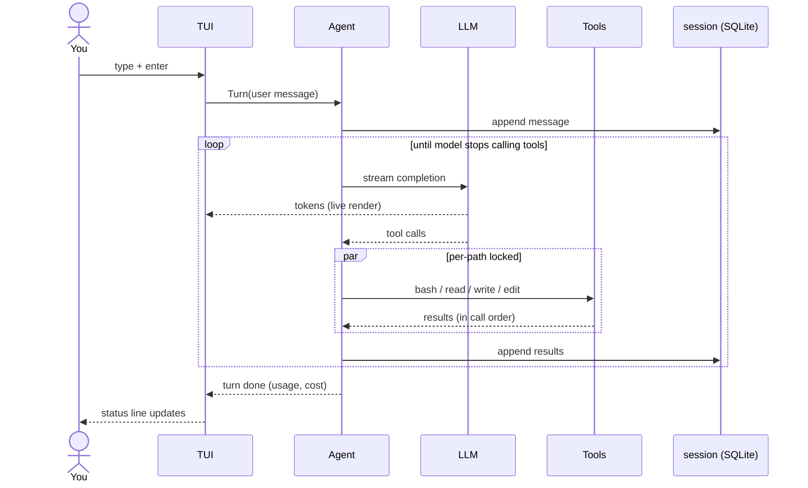

# Architecture

How a keystroke becomes a tool call. ghg is a single Go binary with no
framework between you and the code — each box below is one package under
`internal/`.

## The moving parts

Dependencies point one way: `tui` owns the screen, `agent` owns the
conversation, everything else is a leaf the agent calls. Nothing imports
`tui` except `cmd/ghg` — the loop is headless-testable, and `ghg mcp serve`
reuses the tools without a UI.

## One turn, end to end

Key invariants:

- **The loop is synchronous; concurrency is internal.** From the TUI's view a
  turn is one call. Parallelism (fan-out tool calls, background subagents)
  happens inside `agent` and reports back through typed events.
  See [concurrency.md](concurrency.md).
- **Steering happens at loop boundaries.** A message you send mid-turn is
  queued and injected between iterations — never spliced into a half-streamed
  completion.
- **The provider is an adapter selected at the boundary.** `agent` consumes
  `models.Backend`; the current compiled adapter speaks OpenAI-compatible chat
  completions with streaming. Routing, profile metadata, discovery, pricing,
  and fallback context windows live in `config` + `provider` + the two catalog
  caches (`~/.ghg/models.json` and `~/.ghg/models-dev.json`). See
  [models-providers.md](models-providers.md).

## Where things live on disk

| Path | What | Format |
|---|---|---|
| `~/.ghg/config.json` | providers, models, roles, MCP, and UI settings | JSON, hand-editable |
| `~/.ghg/sessions.db` | conversation history, tasks | SQLite |
| `~/.ghg/models.json` | provider `/models` catalog cache | JSON, 24h TTL |
| `~/.ghg/models-dev.json` | public context and reasoning metadata for listed models | JSON, 24h TTL |
| `~/.ghg/providers/*.yaml` | user provider profiles | strict YAML, non-secret metadata |
| `.ghg/providers/*.yaml` | trusted-project provider profiles | strict YAML, non-secret metadata |
| `~/.ghg/memory.md` | durable memory the model maintains | Markdown checkboxes |
| `.agents/skills/` (repo) | project skills injected into sessions | Markdown `SKILL.md` |
| `.mcp.json` (repo) | claude-style MCP servers | JSON |

Everything is a file you can diff, grep, back up, or delete. There is no
daemon, no hidden state directory schema, no lock file that outlives the
process.

## Package map

| Package | One-liner |
|---|---|
| `internal/agent` | the tool-use loop: `Agent.Turn`, compaction, background subagents, todos |
| `internal/models` | provider profiles, protocol adapters, usage/cost parsing, and model discovery |
| `internal/tools` | bash, read, write, edit, suggest + tool schema definitions |
| `internal/tui` | bubbletea session: transcript, input, settings, status line |
| `internal/config` | config file, model catalog cache, provider resolution |
| `internal/session` | SQLite persistence for conversations and tasks |
| `internal/mcp` | MCP client: three config styles, lazy connect, auto-reconnect |
| `internal/skills` | skill discovery and injection |
| `internal/lsp` | gopls diagnostics surfaced to the model after edits |
| `internal/memory` | markdown-file durable memory |
| `internal/schedule` | `@every` / `@at` wakeups |

## Read next

- [agent-loop.md](agent-loop.md) — the loop in detail
- [concurrency.md](concurrency.md) — the channel patterns
- [features.md](features.md) — full feature map linked to code and tests
