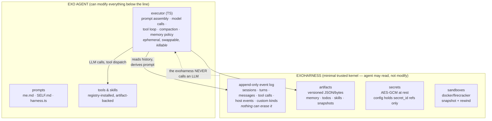
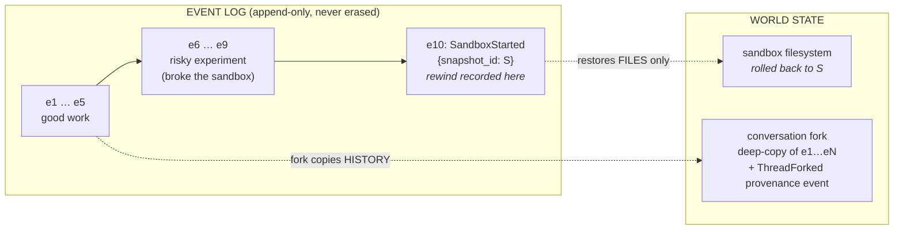
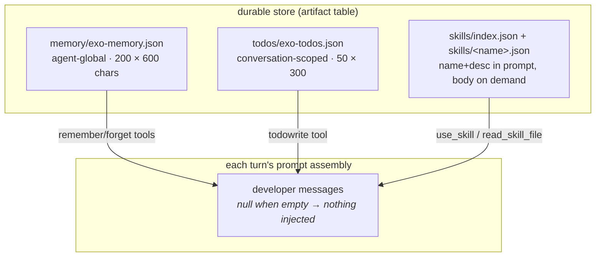
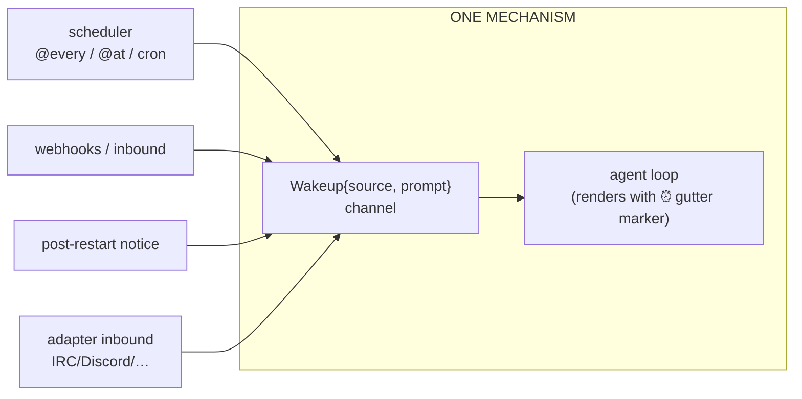
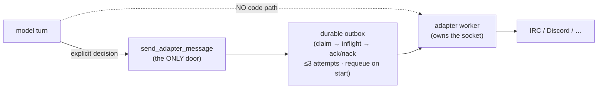

# exo: what harness can learn from it

Source: `/home/abe/code/coding-harnesses/exo` (Rust "exoharness" substrate + TypeScript
executor/harness + Node adapter sidecars). Exo is not a coding-agent TUI — it's a
**long-running personal agent** built for recursive self-improvement: it can read and
edit its own mounted source tree, rebuild and restart itself, snapshot/rewind its
sandbox, schedule recurring work, and talk to IRC/Discord/WhatsApp/Signal/Slack/web
chat. The ideas below are curated for harness (a single-binary Go TUI); the curated
checklist lives in [../../roadmap.md](../../roadmap.md).

The three docs that matter most: `exoharness/docs/spec.md` (architecture),
`docs/RSI.md` (philosophy, 63 lines), `docs/SELF-CONTROL.md` (the self-modification
doctrine — capability inventory + gaps).

## 0. Architecture at a glance



The split: **the executor owns semantics, the exoharness owns durability.** The agent
can rewrite its executor, prompts, and tools — but not the log that records what it
tried.

## 1. The core architectural idea: durable substrate vs. ephemeral policy

Exo splits the harness in two (spec.md):

- **exoharness** (trusted, stateful): agents, conversations, sessions, turns, an
  append-only event log, versioned artifacts, secrets, sandboxes. It **never calls an
  LLM** — "the exoharness stops at the point of executing an LLM call, since to do so
  you must make semantic choices."
- **executor** (ephemeral, swappable): prompt assembly, model calls, tool loop,
  compaction, memory policy. Can be killed without losing the agent; the same agent
  can run under Codex/Claude Code/Cursor SDK executors.

Two spec lines worth internalizing:

- "the durable conversation does not have to equal the prompt. A conversation might
  contain millions of raw events, while an executor sends only a compacted slice,
  summary, or derived view." The prompt is a **derived view**; the log is truth.
- "Custom event types are allowed… to implement compaction, an executor can write a
  custom event that points at a derived context view or summary. Compaction itself
  does not need to exist as a first-class exoharness concept."

Harness already has the SQLite session store; the upgrade is to treat it as an
**append-only event log with typed kinds + custom kinds** instead of a messages table,
and to make `/compact` a recorded event rather than a destructive rewrite.

## 2. The event log (the highest-value subsystem)

`crates/exoharness/src/types.rs` — `EventData` is a serde-tagged enum:
`ThreadCreated/Forked`, `SessionStarted/Ended`, `TurnStarted/Ended`,
`Messages{messages, usage}`, `ToolRequested`, `ToolResult`, `Error`,
`ArtifactWritten`, `Sandbox*`, and `Custom{event_type, payload}` as the universal
extension point. Notable decisions:

- **UUIDv7 ids** → lexicographically sortable → free ordering, cursor pagination,
  and filesystem tailing. (SQLite rowid gives the same in harness.)
- **Usage on the event, not a side table**: each `Messages` event carries
  `{model, prompt/completion/cached tokens, cost_usd, ttft_ms, duration_ms}`. Cost is
  computed in userspace (LiteLLM price DB), stored verbatim by the substrate —
  "cost is policy, and policy lives in userspace"
  (`exoharness/docs/design/cost-tracking.md`).
- **Backwards compat is a hard requirement**: serde aliases + `#[serde(default)]`
  everywhere so old logs keep parsing (tests at types.rs:1107-1203).
- **Host components write into the same log as Custom events**: `host_reboot`,
  `adapter_runner_started` (a start *without* a preceding `host_reboot` implies a
  crash — clever), `adapter_runner_draining`, `rebuild_and_restart_exo`. Host actions
  are part of immutable history, not side channels.
- **The model can query its own log**: `list_conversation_events` defaults to a
  curated lifecycle/host kind set (excluding messages/tool calls "which would drown
  the signal"), with kind filters, cursor, asc/desc. It's also the cost API: query
  `kinds=["messages"]` and sum `usage.cost_usd`.
- **Optimistic head check**: `begin_turn` durably appends input + returns a turn
  handle; writers append with an expected head and fail with
  `ConversationHeadMismatch` if it moved. In SQLite: one CAS `UPDATE … WHERE head=?`
  in the same transaction.
- **Crash recovery**: prompt materialization synthesizes error tool_results for
  dangling tool calls from an interrupted turn ("tool execution did not complete
  before the previous turn ended") — keeps the API's tool-call pairing invariant
  intact across crashes. Directly applicable to harness's `--resume` of a dead turn.

Operator debugging is `pnpm events:tail` — a 266-line script polling the event dir.
For harness this is `harness events --tail <session>` doing `SELECT … WHERE id > ?`.

## 3. Fork vs. rewind: two different time-travel operations



Rewind rolls back the **world** and appends an event saying so. Fork copies the
**history**. Neither deletes anything — the log always explains how you got here.

Exo's cleanest separation (sandbox-snapshots.md:39-41):

> **Not a conversation rewind.** The event log, message history, and prior tool calls
> are untouched. Use `conversation fork` to rewind the conversation itself.

- **Sandbox rewind** restores *world state* (filesystem) and **appends** a
  `SandboxStarted{snapshot_id}` event. History of the failed experiment survives — an
  agent that rewinds and retries "can see what it already tried, instead of repeating
  the same mistake in a loop" (RSI.md). This is the anti-loop argument for keeping an
  append-only log the agent cannot modify.
- **Conversation fork** deep-copies events up to `up_to_inclusive` (re-minting ids),
  plus bindings/secrets/artifacts, and records provenance *inside the new log* as
  `ThreadForked{source, up_to_inclusive}`. Harness's `/fork` already does the
  conversation half.

The durable-vs-resettable state table (`docs/SELF-CONTROL.md` §2) is worth copying
verbatim as a design artifact for harness: code+prompts (git, survives everything),
event log/artifacts/scheduler records (`.exo`, survives rewind+restart), sandbox
filesystem (the *one* resettable layer — "that is the point"), secrets (the one
category that can't be casually recreated).

Harness's missing half is **workspace rewind**: git-snapshot the working tree at each
turn boundary (or on demand), let the model/user roll back files, and append an event
recording the rollback. Opencode's `revert.ts` is the same idea.

## 4. Self-modification doctrine (SELF-CONTROL.md)

Design principles:

- Every self-modification auditable after the fact from event log + git + host logs.
- "Durable mutations go through **named tools with clear schemas**, not hidden
  conventions or ad-hoc file edits to host state. A mutation path that bypasses the
  tools also bypasses the record."
- "Mutations are reversible by default: prefer disabling and checkpointing over
  deletion." (Hence `cancel_scheduled_task` keeps history vs `delete_scheduled_task`;
  `disable_adapter` vs `delete_adapter`.)

The flagship tool is `rebuild_and_restart_exo` (`exo/tools/guardian-tools.ts`):

```mermaid
sequenceDiagram
    participant M as model turn
    participant T as rebuild_and_restart_exo
    participant D as detached deferred script
    participant G as guardian (host)
    participant L as event log

    M->>T: call with reason "add webhook adapter"
    T->>L: write guardian-updates/&lt;id&gt;.json {status: queued, reason}
    T->>D: spawn detached, sleep 2s
    T-->>M: return updateId immediately (turn finishes)
    M->>M: announce "going down" via send_adapter_message
    D->>G: rebuild + restart-all --build
    G->>G: write .restart marker → runner claims it,<br/>finishes in-flight work, exits (15s claim / 300s grace)
    G->>G: start new build + write reboot notice
    D->>L: finalize outcome (succeeded/failed) + host event
    Note over M,L: next turn, model asks list_conversation_events:<br/>"did my update land?"
```

1. Synchronously write `.exo/guardian-updates/<uuid>.json` `{status:"queued", reason}`
   (reason is a required free-text param so the record is self-describing).
2. Spawn a **detached** deferred script, return the updateId immediately so the turn
   can finish (and announce downtime in the same turn).
3. The script sleeps 2s, rebuilds, drains services via **marker files** (runner claims
   `.exo/exo-scheduler.restart` by deleting it, finishes in-flight work, exits;
   15s to claim, 300s grace, then process-tree kill), restarts on the new build.
4. Outcome written to the outcome file **and** appended to the conversation's event
   log — so the model can later ask `list_conversation_events` "did my update land?"

For harness this becomes: a `rebuild_and_restart_harness` tool + drain marker claimed
between turns + Unix `exec()` to swap the binary image. See roadmap.

## 5. SELF.md: the navigational self-map

`exo/SELF.md` (149 lines) is checked in and its **path** is injected into the prompt
each turn (`EXO_SELF_MAP`), not its contents — reading it is an agent action. It's
navigation, not architecture docs: Important Paths (~18 one-liners), Local State
(what's git-ignored, don't commit profile data), Common Commands, Tool Architecture
(the recipe for adding a tool), a **diagnosis decision procedure** (health fields →
telemetry → event log → only then escalate to operator logs), Maintenance Rules.

`exo/prompts/me.md` (26 lines) is the durable identity: ~15 operating rules, several
directly stealable for any agent:

- "The set of tools available changes turn to turn… never assume a tool exists
  because it did earlier, and check the current set before calling one."
- "Bias toward acting… after about three failed attempts on the same blocker, stop
  and escalate it plainly instead of looping." Autonomous (no user attached): "record
  the blocker clearly and fail loudly rather than waiting."
- "Do not speculate about code you have not opened… cite it as
  `file_path:line_number`." (harness already has this.)
- Git hygiene: "review the staged diff for secrets first. Never run `git add .` —
  stage only the files you intend to commit — and never force-push."

## 6. Prompt assembly (exo/harness.ts)

Each turn's developer messages, in order: base instructions → identity (me.md) →
display name → one big operational doc (## Scheduled tasks, ## Sandbox snapshots, ##
Self-maintenance, ## Creating managed tools, ## Adapters, ## Memory, ## Todos, ##
Skills, ## Web access) → setup prompts → self-map pointer → local profile
(`.exo/exo-profile.md`, git-ignored, user-specific) → dynamic blocks (memory, todos,
skills) that **return null when empty** so nothing is injected. Tools are
**re-registered every model round**, so installs take effect mid-turn.

Also: strict-schema teaching *inside tool descriptions* (every property in
`required`, nullable types for optionals, `additionalProperties:false`) — exo makes
**all** tool params required (nullable where optional) so the model makes an explicit
choice per field.

## 7. Memory, todos, skills — the artifact pattern

All three use the same shape: a versioned JSON artifact + a per-turn developer-message
injection with hard caps so prompt growth is bounded:



- **Memory** (`exo/tools/memory-tools.ts`): agent-global store
  `memory/exo-memory.json`, `remember(text)`/`forget(id)`, caps 200 entries × 600
  chars, oldest dropped on overflow (result reports `dropped`). Deliberately **not**
  embedding-based: "for a small set of short facts, always injecting the whole store
  is simpler and easier to audit." Corrupt store: writes throw (don't bury it) but
  prompt assembly **degrades loudly** ("memory is temporarily unavailable") instead of
  bricking every conversation or silently pretending empty.
- **Todos** (`exo/tools/todo-tools.ts`): conversation-scoped, full-list rewrite each
  call, one item in_progress, "mark completed only after verified," caps 50×300, not
  injected when all done.
- **Skills**: same progressive disclosure as harness (names+descriptions injected, body
  on demand), but stored as **artifacts** (`skills/index.json` + `skills/<name>.json`)
  instead of a directory scan — survives sandbox rewinds, versioned, auditable;
  install validates frontmatter and rejects `..` paths. Uninstall removes the index
  entry only; old versions remain readable.

Harness translation: a `memory`/`artifacts` table in sessions.db. Note exo flags a
read-modify-write race in its file store that SQLite makes disappear.

## 8. The scheduler (cron for agents)

A separate runner process + 4 model tools. The whole schedule grammar is ~70 lines:
`@every 10m`, `@at <rfc3339>` (one-shot, stays listed as completed), `*/N * * * *`
(deliberately only minute-intervals). Semantics worth copying:

- **Grid-anchored fires** (`anchor_ms + n×interval`) — a slow run never drifts the
  schedule.
- **Missed-fire policy** per task: `skip` | `once` (default) | `all` capped at 100
  ("a self-inflicted stampede" guard); the last evaluation is recorded so listings
  show skipped runs rather than gaps.
- **Record-then-deliver**: the fire record (prompt included) is persisted *before*
  the wakeup is attempted, cleared only after it lands, and redelivered on startup.
  This is what makes a crash between "command finished" and "turn started"
  recoverable instead of silent.
- **`reportPrompt`**: the agent's own instruction to its future self about how to
  summarize/route the result — embedded in the wakeup. Zero-machinery composition
  with any outbound channel.
- Full run output → versioned artifact; wakeup carries 4KB previews + exit code +
  artifact ref.

Wakeups are just **machine-authored user messages** (file-lock serialized per
conversation). The model can't distinguish a scheduler turn from a human turn except
by prompt content — one internal `Wakeup{source, prompt}` channel serves cron,
webhooks, adapter inbound, and reboot notices alike:



## 9. Adapters (the long pole — skim for later)

Adapters = supervised sidecar processes speaking 7-event JSONL over stdio; the model
manages them with `create/list/enable/disable/delete_adapter` and
`send_adapter_message`. The stealable bits, in order of value:

1. **The explicit-send boundary is structural**: there is *no code path* from model
   text to the external channel; the only door is `send_adapter_message` writing to a
   durable outbox:


   wakeup prompt enforces the social half: "you MUST reply externally with
   send_adapter_message using adapterId X and target Y, or explicitly decide not to."
2. **Health fields + telemetry tiers**: `last_connected_at_ms`, `last_error` on the
   record; append-only per-adapter events (`connected/disconnected/inbound/outbound/
   error/lifecycle`); diagnosis order: health → events → logs → restart.
3. **Drain markers + process groups** for restart without torn state.
4. **Trigger policies** (`mention` vs `all_messages`) — "waking the model for every
   line would be noisy and expensive."
5. **exo-chat**: phone access via an outbound-only WebSocket to a ~200-line dumb
   relay (Cloudflare DO) with HKDF/AES-GCM e2e frames; setup is "open this URL."

## 10. Secrets as references

Config stores only `secret_id` references; AES-256-GCM at rest with a master key in
Keychain or a 0600 file; decrypted host-side at point of use; the model and the event
log never see values. Tool initialization uses literal `"${ENV_VAR}"` references
resolved at load time "so the raw value never enters the lockfile." (This overlaps
with the existing roadmap item for `"$VAR"`/`"!cmd"` apiKey resolution.)

## What harness should probably NOT take

- The full adapter fleet + guardian bash scripts + multi-process supervision —
  that's a different product (always-on personal agent). Take the wakeup channel and
  outbox patterns only if/when harness grows external channels.
- Firecracker/E2B/Daytona sandbox backends — harness runs where the user runs.
- Manifest-based agent-installed TS tools — harness's answer to dynamic capability is
  skills + MCP, and that's fine.
- The conversation/thread mid-rename churn and file-per-event storage — SQLite is
  strictly better for harness's scale.
