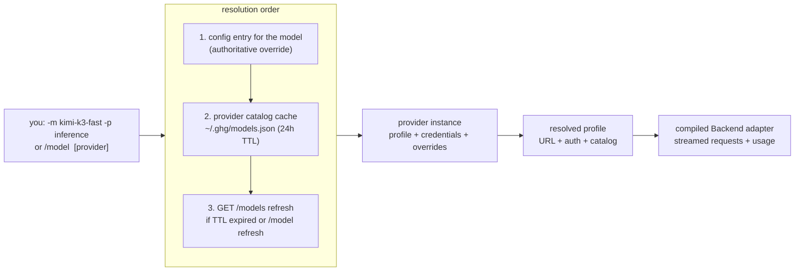
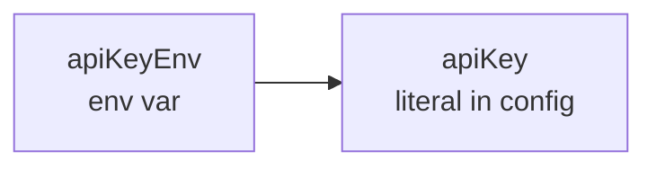

# Models & providers

ghg is provider-agnostic at the agent boundary: models route to providers,
the selected compiled adapter owns wire details, and the model catalog is
discovered live — there is no registry to update when a new model ships.

## Routing model



- A model lists the providers that serve it (`"models": {"kimi-k3-fast":
  {"providers": ["inference"]}}`), so switching providers doesn't touch the
  model name.
- **Catalog models need no config entry.** Any model advertised by a
  provider's `GET /models` is usable directly; config entries are overrides
  when present.
- If several providers advertise the same id, pass a provider
  (`-p` / `/model <name> <provider>`) to disambiguate.
- Newly announced models appear in the `/model` picker dimmed, marked
  `(new)`, after `/model refresh` or the next TTL cycle.
- A profile may add ordered `routes` keyed by `path.Match` model globs.
  The first matching route overrides only the protocol, auth mode/header, and
  default headers; unmatched models use the profile defaults. A model's
  explicit `"api"` field overrides the route.

## Model roles

The optional JSONC `roles` block accepts only `default`, `smart`, `fast`, and
`tiny`:

```jsonc
"roles": {
  "default": { "provider": "example", "model": "example-model" },
  "smart":   { "provider": "example", "model": "planning-model" },
  "fast":    { "provider": "example", "model": "fast-model" },
  "tiny":    { "provider": "example", "model": "small-model" }
}
```

Acting sessions use `fast` by default and planning sessions use `smart`.
Compaction and delegated `task` calls use `tiny`. An absent role falls back to
`default`, then `defaultModel/defaultProvider`; a configured but invalid role
is an error. `ghg run --role smart` selects a role for a headless run, while
`-m`/`-p` remain explicit route overrides.

## Declarative profiles

The JSONC provider entry is the instance: it owns the credential reference and
may override the profile's URL or protocol. The reusable profile is non-secret
YAML:

```jsonc
{
  "providers": {
    "my-openrouter": {
      "profile": "openrouter",
      "apiKey": "$OPENROUTER_API_KEY"
    },
    "lab": {
      "profile": "generic-openai",
      "baseUrl": "http://127.0.0.1:8080/v1",
      "apiKey": "$LAB_API_KEY"
    }
  }
}
```

Profiles load in this order: binary-embedded defaults, then
`~/.ghg/providers/*.yaml`, then `.ghg/providers/*.yaml` when the
current project is trusted. A later level replaces an earlier profile ID, but
duplicate IDs within one level are errors. Unknown fields, schema versions,
protocols, catalog kinds, auth modes, unsafe URLs, and credential-shaped
profile fields fail with the source path in the error. HTTPS is required;
plain HTTP is limited to explicit loopback endpoints.

The shipped IDs are `inference`, `openrouter`, `generic-openai`, `anthropic`,
`commandcode`, and `opencode`. The CommandCode profile uses Chat Completions
for non-Claude models and native Messages for `claude-*`; provider API access
requires an eligible CommandCode plan because the Go plan excludes it. The
single OpenCode Go profile points at one public catalog and uses ordered model
routes to select chat completions or native Messages; the unsupported Responses
route is shown as unavailable before a turn. Existing JSONC providers without
`profile` keep working through anonymous in-memory profiles, so no config
migration is required. A provider
entry that still names the removed `opencode-anthropic` profile is retained
through a compatibility anonymous route.

## Key resolution

Per provider, in order:



First hit wins. Profile YAML never resolves or stores a key; no key material
ever lives in the session store.

## Profile-driven authentication

Every loaded provider profile can be connected through the same onboarding
flow. The profile ID is the command argument; OpenRouter is simply one of the
embedded profiles, not a special code path:

```sh
ghg auth openrouter              # masked prompt for the profile's key
ghg auth openrouter sk-or-…      # key as an argument
ghg auth openrouter --env        # record the profile's auth.env_var
ghg auth generic-openai <key>    # any loaded profile works the same way
```

Inside a running session, `/auth` lists all profile IDs and configured status,
`/auth <id>` opens a masked prompt, and `/auth <id> <key>` accepts a direct
key. A rejected credential is never saved. Literal mode stores `apiKey`; env
mode stores only the profile's `auth.env_var`, and the two modes replace one
another without leaving a second credential field behind. A profile with
`auth.kind: none` refuses key entry.

Catalog-capable profiles whose catalog requires credentials use their
authenticated `GET /models` response both to validate the key and to seed
`~/.ghg/models.json`. Public catalogs are fetched first only to obtain a
real model ID; an authenticated one-token probe then validates the key by
distinguishing `error.type: AuthError` from model/request errors. Catalog-less
profiles use one authenticated protocol probe and remain usable without a
catalog. If no validation capability exists, ghg asks before storing the
key and labels it **unvalidated**. Setup hints come from `docs.keys_url` when a
profile provides one.

Keys entered in the TUI are masked and kept out of input history, queued chat
messages, transcript blocks, and the event log. Validation errors redact a
provider response that echoes the key. Custom profiles can be added under
`~/.ghg/providers/*.yaml` without a Go code change; profile routes are the
place to describe one base URL serving multiple wire protocols.

For example, a model-level escape hatch can force a compiled adapter when a
profile route table has not caught up:

```jsonc
{
  "models": {
    "new-model": {
      "providers": ["opencode"],
      "api": "openai-chat-completions"
    }
  }
}
```

OpenRouter remains an especially useful example: its single OpenAI-compatible
endpoint exposes a broad catalog, so after `ghg auth openrouter` you can
use `/model openai/gpt-5`, `/model anthropic/claude-sonnet-4.5`, or any other
advertised ID without adding individual model routes. Per-model overrides
still compose by adding an entry under `"models"` with
`"providers": ["openrouter"]`.

## Token bookkeeping

Three numbers with distinct meanings:

| Field | Meaning | Drives |
|---|---|---|
| `context` | model's **input** window | proactive compaction threshold for reported prompt+completion usage |
| `maxOut` | optional **output** cap | request `max_completion_tokens` |
| provider `context_length` | advertised limit | overrides `context` when present |
| models.dev `reasoning_options` | model-specific effort/toggle controls | `/effort`, the clickable effort indicator, and request lowering |

The old `maxTokens` field still parses (it always meant the context window)
but is superseded by `context`. When config or the provider catalog omits the
limit, or when the catalog omits reasoning controls, ghg uses the matching
`limit.context` and `reasoning_options` from the daily models.dev cache at
`~/.ghg/models-dev.json`. The cache is fetched lazily for listed models only.
The upstream endpoint is an all-provider snapshot, but ghg retains only the
requested model IDs. A profile may set `catalog.models_dev` when its provider
ID differs from the profile ID. Effort values are model-specific: a graded
list may include `max`, while a toggle-only model exposes `off`/`on`; an
explicitly empty option list exposes `off` only.

## Cost tracking

When the provider advertises `pricing` in `GET /models`, the status line
shows session spend: `llm.Usage` (prompt/completion/cached) comes off each
streamed response, cached input is billed at the cache-read rate, and totals
accumulate per session. Hidden entirely when pricing isn't advertised.

## Compaction model

Compaction summarizes with a separate, cheaper model: an explicit
`compactModel`/`compactProvider` override wins; otherwise the configured `tiny`
role is used. Legacy configs without roles retain
`deepseek-v4-flash-0731` (`config.DefaultCompactModel`), falling back to the
conversation's own model when unavailable. `/compact <model> [provider]` picks
the summarizer by hand. Mechanics: [agent-loop.md](agent-loop.md#compaction).

## Read next

- [features.md](features.md#models--providers) — linked to code and tests
- README §Config — the full `~/.ghg/config.json` reference
