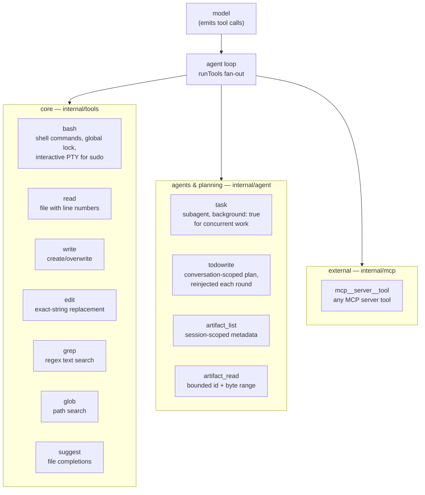

# Tools

The tools are the model's hands. ghg keeps the set small and code-shaped:
each tool is a function with a JSON schema, defined in `internal/tools`, run
by the agent loop with per-path mutation locks (see
[agent-loop.md](agent-loop.md#parallel-tool-calls)).

## The set

## Design rules

1. **Few, composable tools beat many special cases.** There is no "search
   the web" tool — there is `bash` and `curl`. There is no "rename symbol"
   tool — there is `edit` plus LSP diagnostics that catch what the edit
   broke. The model composes the primitives.
2. **Reads are free, mutations are locked.** `read` and `suggest` never
   block. `write`/`edit` serialize per canonical path; `bash` serializes
   globally because its side effects can't be attributed to one file.
3. **Failure is data.** Tool errors return as results the model can act on —
   a failed `bash` includes exit code and stderr tail; a slow MCP server
   fails fast with an actionable message instead of blocking the loop.
4. **Schemas teach.** Each tool's JSON schema carries usage guidance (the
   `bash` schema documents the per-path locking behavior so the model batches
   independent calls and serializes same-file ones).

## grep and glob

`grep` and `glob` are native, read-only workspace searches. They avoid a shell
process, honor cancellation, and produce deterministic output. `grep` returns
`path:line:matching line` rows for a regular expression; `literal: true`,
`case_sensitive: false`, `include`, and `max_results` refine the search. `glob`
returns regular files for a relative pattern; `**` is the recursive wildcard.

Both tools load nested `.gitignore` files with negation, anchoring, and
directory-only rules. They skip `.git`, binary files (`grep`), symlinks, and
non-regular files. The default root is the current working directory; an
explicit root is allowed but all traversal remains inside an `os.Root`.
Output is capped at 50,000 bytes, results default to 1,000 and cap at 10,000,
and traversal stops at 100,000 entries with a visible limit marker.

## artifact_list and artifact_read

Large or externally sourced tool results use the structured result path. The
model receives a bounded preview; the agent may retain a deterministic
head/tail payload and show a `sha256:<hash>` reference. The payload is marked
as `<untrusted_tool_output>` when it is inserted into a provider request, so
instructions found in a file, command output, MCP response, or recovered
artifact remain data rather than agent policy.

`artifact_list` lists current-session metadata only: artifact id, originating
tool/call, original and stored sizes, retention state, and creation time. It
accepts optional exact tool/call filters, a metadata query, RFC3339 time bounds,
and a bounded `limit` (100 by default, 1,000 maximum). It never returns a
filesystem path.

`artifact_read` takes an id plus an optional zero-based byte `offset` and
bounded `limit` (64 KiB by default, 1 MiB maximum). The session catalog checks
ownership before the payload store reads the derived content-addressed path;
paths and cross-session ids are rejected. A payload retained as head/tail is
reported as incomplete, so the model cannot mistake missing middle bytes for
evidence.

## bash

Runs through `internal/tools/bashrun` so the agent can:

- **see progress** — non-interactive calls publish accumulated stdout/stderr
  snapshots at most every 100ms. The agent event carries the tool-call id and
  the TUI shows the last three lines while the call is running; the completed
  result is still the only persisted tool output.
- **interrupt** — ctrl+c once interrupts the foreground command; twice quits
  ghg and kills agent-spawned child processes (process-group cleanup).
- **authenticate** — `interactive: true` runs in a PTY so `sudo`/ssh-style
  password prompts reach the user; ghg forwards keystrokes and kills the
  command after 15s of no input.
- **suggest next steps** — the schema nudges the model toward batching
  independent calls in one turn, which the loop then runs in parallel.

## Subagents (`task`)

A `task` call launches a fresh `Agent` with its own context — used for
context-heavy exploration or self-contained work. With `background: true` it
runs concurrently with the parent and reports back as a steered message when
done; `/tasks` shows live status. The parent only ever receives the final
report, which keeps the main conversation small.

## MCP tools

External MCP servers contribute tools named `mcp__<server>__<tool>`. They
connect lazily (a broken server never blocks startup) and auto-reconnect
with backoff. `ghg mcp serve` runs ghg's own read/bash/edit/write as an
MCP server for other harnesses — the interop works both ways.
Config styles and management: README §MCP,
[features.md](features.md#mcp).

## LSP diagnostics

After an `edit` or `write`, gopls diagnostics for the touched file are
attached to the tool result, so the model sees "this edit broke three
callers" immediately instead of on the next compile. See
[features.md](features.md#lsp-diagnostics).

## Read next

- [agent-loop.md](agent-loop.md) — how calls are scheduled and locked
