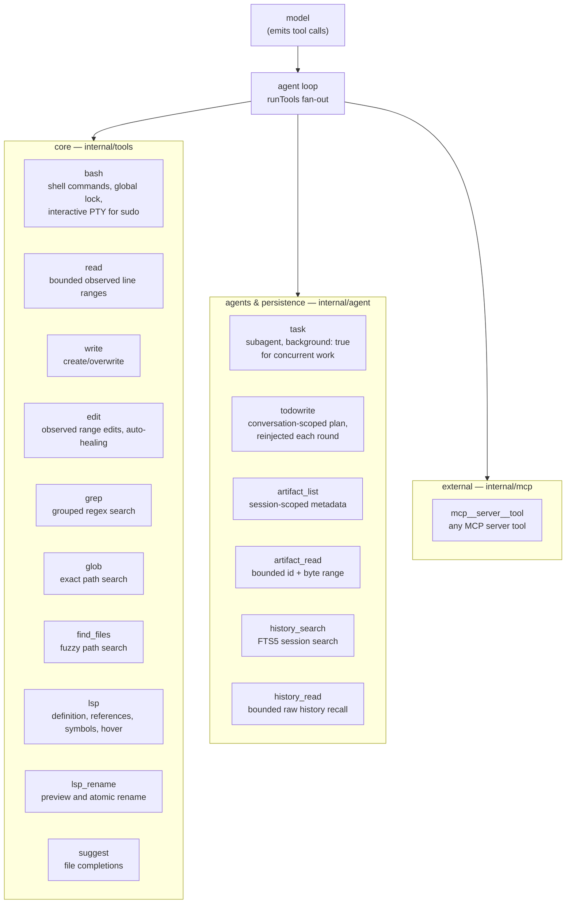

# Tools

The tools are the model's hands. ghg keeps the set small and code-shaped:
each tool is a function with a JSON schema, defined in `internal/tools`, run
by the agent loop with per-path mutation locks (see
[agent-loop.md](agent-loop.md#parallel-tool-calls)).

## The set

## Design rules

1. **Dedicated exploration stays bounded.** `grep` searches text, `glob`
   handles exact paths, `find_files` handles fuzzy paths, and `read` returns
   complete numbered ranges. Bash is for builds, tests, git, and operations
   those tools cannot express.
2. **Reads are observations; mutations are locked.** `read` records the exact
   bytes issued to the model. Observed `edit` ranges must match that evidence;
   write/edit serialize per canonical path, while bash takes the global lock.
3. **Failure is data.** Tool errors return as results the model can act on —
   a failed `bash` includes exit code and stderr tail; a slow MCP server
   fails fast with an actionable message instead of blocking the loop.
4. **Schemas teach.** Each tool's JSON schema carries usage guidance (the
   `bash` schema documents the per-path locking behavior so the model batches
   independent calls and serializes same-file ones).

## grep and glob

`grep`, `glob`, and `find_files` are native, read-only workspace searches. They
avoid a shell process, honor cancellation, and produce deterministic output.
`grep` accepts one regular expression or a `patterns` OR array, groups matches
by file, ranks touched/modified and narrow-path results, and defaults to 25
matches per page. `glob` is exact; `find_files` scores every candidate before
selecting fuzzy path matches. Each search can return a cursor for a stable
session snapshot.

`grep` and `glob` load nested `.gitignore` files with negation, anchoring, and
directory-only rules. All three skip `.git`, symlinks, and non-regular files;
`grep` also skips binaries. The default root is the current working directory;
an explicit root is allowed but all native traversal remains inside an `os.Root`.
The model-facing search page is capped at 8 KiB, while the cursor snapshot is
bounded by the artifact ceiling. Results cap at 10,000 and traversal stops at
100,000 entries with an explicit incomplete-retention warning. Large retained
snapshots use the normal artifact path.

## read observations and edit

`read` returns at most 500 complete numbered lines (1,000 maximum) and a
64 KiB output budget. It includes an opaque observation id and continuation
offset, and stores the exact original line bytes in the session registry. A
primary `edit` uses `mode: "observed"` with one `edits` array; operations are
`replace`, `delete`, `insert_before`, or `insert_after` and target an
issued range from the same session and canonical path.

If an edit is invoked with a missing or expired observation, `edit` automatically
reads the current file on disk and synthesizes a fresh observation on the fly (saving
a full round-trip `read` call). Successful edits automatically emit fresh observation IDs
in the readback header for zero-roundtrip consecutive fixes. If surrounding lines
shift, only one exact occurrence of the stored bytes may relocate the range.

Multi-file observed edits preflight immutable originals, permissions, and
intersections, acquire sorted path locks, stage same-directory temporary files,
publish each with rename, and best-effort roll back earlier publications on a
later failure. Results contain a compact diff, changed-line readback, and LSP
diagnostics. File modes and line endings are preserved.

## artifact_list and artifact_read

Large or externally sourced tool results use the structured result path. The
model receives a bounded preview; the agent may retain a deterministic
head/tail payload and show a `sha256:<hash>` reference. The payload is marked
as `<untrusted_tool_output>` when it is inserted into a provider request, so
instructions found in a file, command output, MCP response, or recovered
artifact remain data rather than agent policy.

`artifact_list` lists current-session metadata only: artifact id, originating
tool/call, original and stored sizes, retention state, and creation time. It
accepts optional exact tool/call filters, a metadata query, RFC3339 time bounds,
and a bounded `limit` (100 by default, 1,000 maximum). It never returns a
filesystem path.

`artifact_read` takes an id plus an optional zero-based byte `offset` and
bounded `limit` (64 KiB by default, 1 MiB maximum). The session catalog checks
ownership before the payload store reads the derived content-addressed path;
paths and cross-session ids are rejected. A payload retained as head/tail is
reported as incomplete, so the model cannot mistake missing middle bytes for
evidence.

## bash

Runs through `internal/tools/bashrun` so the agent can:

- **avoid accidental exploration** — simple recursive `grep`, `find .`,
  `ls -R`, and inspection-only `cat`/`sed` calls return a dedicated-tool
  redirect without executing. Pipelines, `git grep`, advanced predicates, and
  paths outside the workspace remain an explicit bash escape hatch.

- **stay within context** — recognized search/listing output previews are
  capped near 8 KiB; ordinary commands near 14 KiB. The retained result still
  follows the artifact policy, and JSON runs receive per-tool byte/redirect
  telemetry.

- **see progress** — non-interactive calls publish accumulated stdout/stderr
  snapshots at most every 100ms. The agent event carries the tool-call id and
  the TUI shows the last three lines while the call is running; the completed
  result is still the only persisted tool output.
- **interrupt** — ctrl+c once interrupts the foreground command; twice quits
  ghg and kills agent-spawned child processes (process-group cleanup).
- **authenticate** — `interactive: true` runs in a PTY so `sudo`/ssh-style
  password prompts reach the user; ghg forwards keystrokes and kills the
  command after 15s of no input.
- **suggest next steps** — the schema nudges the model toward batching
  independent calls in one turn, which the loop then runs in parallel.

## Subagents (`task`)

A `task` call launches a fresh `Agent` with its own context — used for
context-heavy exploration or self-contained work. With `background: true` it
runs concurrently with the parent and reports back as a steered message when
done; `/tasks` shows live status. The parent only ever receives the final
report, which keeps the main conversation small.

## MCP tools

External MCP servers contribute tools named `mcp__<server>__<tool>`. They
connect lazily (a broken server never blocks startup) and auto-reconnect
with backoff. `ghg mcp serve` runs ghg's own read/bash/edit/write as an
MCP server for other harnesses — the interop works both ways.
Config styles and management: README §MCP,
[features.md](features.md#mcp).

## LSP navigation and diagnostics

`lsp` provides fast, in-memory language server navigation:
- `definition` — jump directly to symbol definition across files.
- `references` — locate all callers/references of a symbol.
- `document_symbol` — retrieve a high-level symbol outline of large files without reading the full file.
- `hover` — inspect types, signatures, and documentation comments.

`lsp_rename` performs safe, cross-file symbol renames with a preview step and atomic locked multi-file publication. After any `edit` or `write`, gopls diagnostics for touched files are attached to the tool result.

## History recall (`history_search` and `history_read`)

`history_search` queries the session's rebuildable SQLite FTS5 index over previous assistant, user, and tool messages with stable cursor pagination. `history_read` retrieves bounded raw message sequences as untrusted evidence without polluting or expanding active prompt context.

## Read next

- [agent-loop.md](agent-loop.md) — how calls are scheduled and locked
